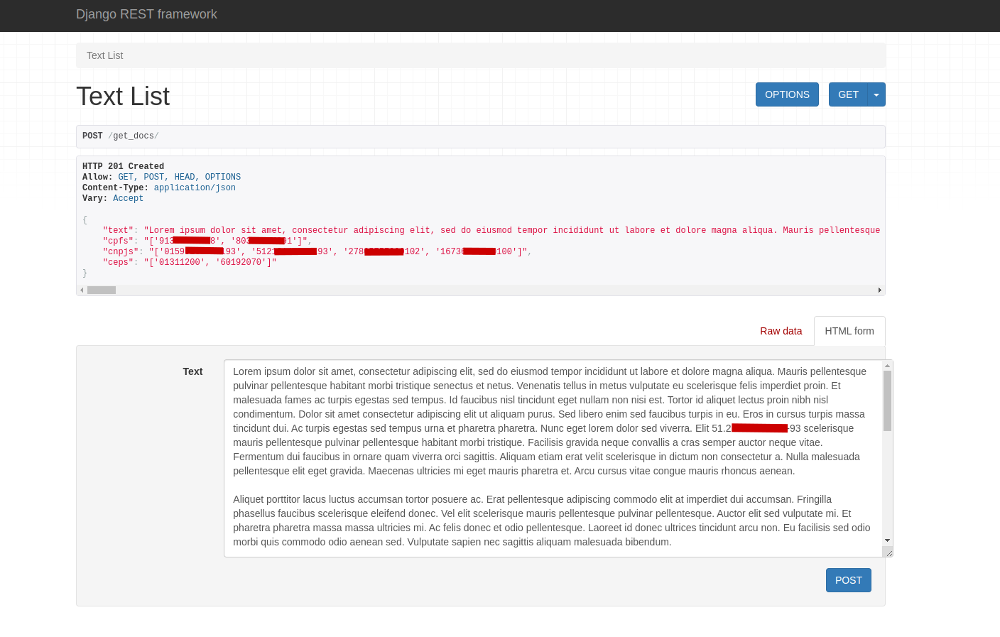
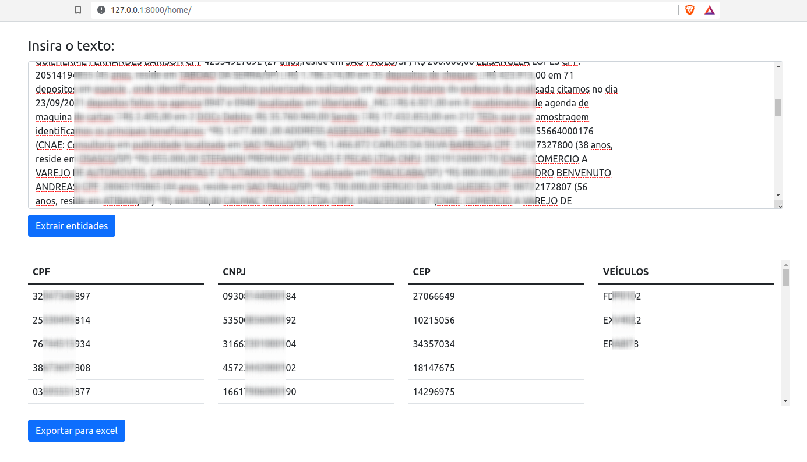

# Get Brazilian docs

#### This Rest API fetch main Brazilian personal documents in texts.

Check it out at https://get-brazilian-docs.herokuapp.com/get_data/.

### Technologies:

- Python
- Django
- Django Rest Framework
- Docker

### Highlights:

Currently, search for 3 kinds of Brazilian documents:

1. CPF  - citizen unique ID.
2. CNPJ - companies unique ID.
3. CEP  - Brazilian zip code.
4. CARS - Brazilian (and Mercosul) car plates.

Official documents algorithms of validation are applied (thanks to [validate-docbr](https://github.com/alvarofpp/validate-docbr) lib).

Also include a Home page to get the text data and export to an Excel file.

### Requirements:

    - Python 3+
    - Docker
  
### Installation:

    git clone https://github.com/Gabriel-Nunes/get_br_docs.git
    cd get_br_docs
    docker build -t get_docs .
    docker run -p 8000:8000 get_docs
